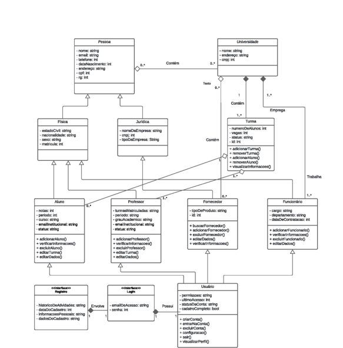
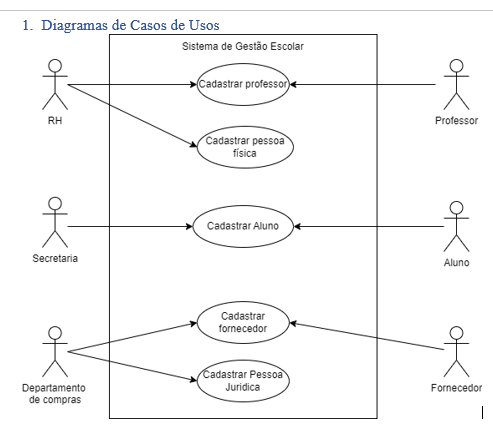

# gest-o-escolar-PI
Projeto Integrador: Desenvolvimento de Sistemas Orientado a Objetos - GRUPO 33

Repositório destinado ao trabalho do Projeto Integrador do SENAC. O grupo contém 7 integrantes: 

- Julia Oliveira
- Anna Carolina de Oliveira -https://github.com/annacarl1na 
- João Vitor
- Renata Dayana - https://github.com/RenataDayana 
- Richard Guilherme
- Matheus Santos
- Maryanne Santos

## Introdução

O projeto consiste na modelagem e prototipagem de um sistema web direcionado a instituições de ensino. O projeto é focado nesse primeiro momento nas etapas de cadastro de pessoas físicas e jurídicas, além de algumas funcionalidades básicas.

## Requisitos Funcionais

#### RF1 - Cadastro de Alunos
- O sistema deve permitir que o secretário cadastre novos alunos fornecendo nome, RG, CPF, data de nascimento, endereço, telefone e email pessoal.
#### RF2 - Cadastro de Professores
- O sistema deve permitir que o secretário cadastre novos professores fornecendo nome, RG, CPF, data de nascimento, endereço, telefone e email pessoal.
#### RF3 - Cadastro de Fornecedores
- O sistema deve permitir que o departamento financeiro cadastre novos fornecedores informando razão social, nome fantasia, CNPJ, serviço fornecido, endereço, telefone e email.
#### RF4 - Cadastro de Aulas
- O sistema deve permitir que os professores insiram vídeo-aulas no formato MP4, MOV, WMV ou AVI.
#### RF5 - Visualização de Aulas
- O sistema deve permitir que os alunos assistam às video-aulas postadas pelos professores.

## Requisitos Não-Funcionais

- RNF1: O sistema deve ser capaz de lidar com um grande volume de cadastros de alunos, professores e fornecedores sem comprometer o desempenho.
- RNF2: O tempo de resposta para a postagem de aulas não deve exceder 5 segundos.
- RNF3: O acesso ao sistema deve ser protegido por autenticação, exigindo nome de usuário e senha válidos.
- RNF4: Os dados dos alunos, professores, e fornecedores devem ser armazenados de forma segura, seguindo as melhores práticas de segurança da informação.
- RNF5: A interface do sistema deve ser intuitiva e de fácil utilização, para que tanto o secretário quanto o departamento financeiro possam realizar suas tarefas sem treinamento extensivo.
- RNF6: O sistema deve ser compatível com diferentes dispositivos e navegadores para garantir acessibilidade para todos os usuários.
- RNF7: O sistema deve ser altamente confiável, minimizando o tempo de inatividade e garantindo a disponibilidade das funcionalidades essenciais durante o horário de trabalho.

## Modelagem

Diagrama de classes do sistema de gestão escolar

## Protótipos de Interface
- Protótipos em construção.

